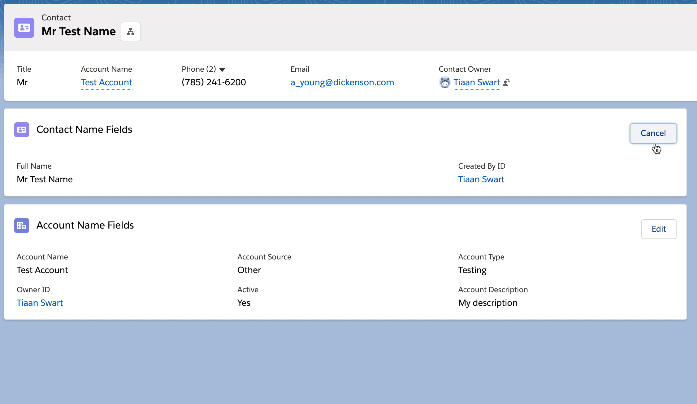

# Lightning Web Component Fieldset

Lightning Web Component to show a Record Form for viewing and editing. Constructed from a Fieldset.

 

# Demo:

 

 

# Setup after deployment

1. Navigate to a Lightning Record Page
1. Navigate to the Lightning App Builder
1. Drag the FieldSet custom component on to the desired location in the page
1. Set the properties

## FieldSet Component Properties

| Property Name      | Type                            | Label                       | Default                  | Description                                               | Required |
| ------------------ | ------------------------------- | --------------------------- | ------------------------ | --------------------------------------------------------- | -------- |
| `showTitle`        | `Boolean`                       | Show title                  | `true`                   |                                                           | N/A      |
| `strTitle`         | `String`                        | Enter a title               | N/A                      | Enter a custom title or leave blank to use FieldSet label | `false`  |
| `iconName`         | `String`                        | Enter an icon name          | N/A                      | Enter a valid icon name to display from SLDS              | `false`  |
| `columnsLarge`     | `String` - `datasource=[1,2,3]` | Columns (Large Device)      | `3`                      |                                                           | `true`   |
| `columnsMedium`    | `String` - `datasource=[1,2,3]` | Columns (Medium Device)     | `2`                      |                                                           | `true`   |
| `columnsSmall`     | `String` - `datasource=[1,2,3]` | Columns (Small Device)      | `1`                      |                                                           | `true`   |
| `fieldSetName`     | `String`                        | Enter the Fieldset API Name | N/A                      |                                                           | `true`   |
| `isEditable`       | `Boolean`                       | Enable Editing              | `true`                   |                                                           | N/A      |
| `alwaysEditing`    | `Boolean`                       | Force Editing State         | N/A                      |                                                           | N/A      |
| `saveMessageTitle` | `String`                        | Save Message Title          | `Success`                |                                                           | `true`   |
| `saveMessage`      | `String`                        | Save Message                | `Record has been saved.` | Custom message to display when the record has been saved  | `true`   |

## Related FieldSet Component Properties

(Same as above with addional below)

| Property Name  | Type     | Label         | Default | Description | Required |
| -------------- | -------- | ------------- | ------- | ----------- | -------- |
| `relatedField` | `String` | Related Field | N/A     |             | `true`   |
